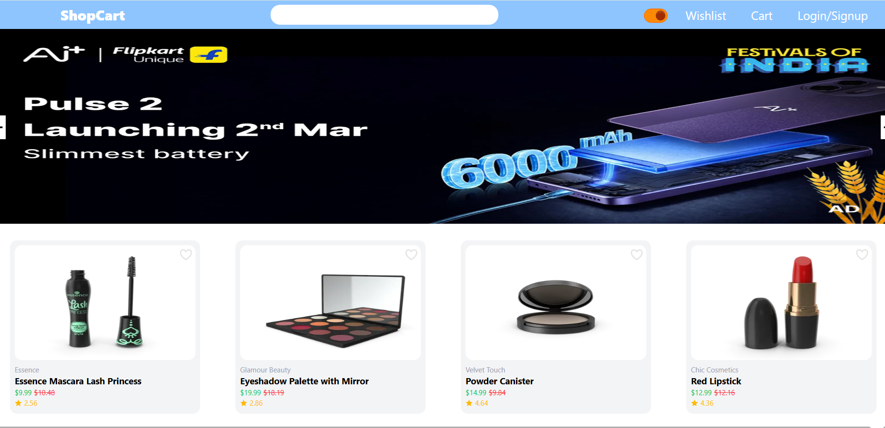
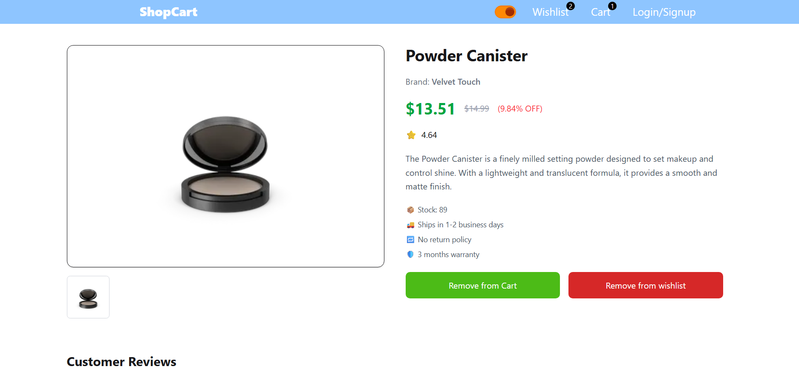
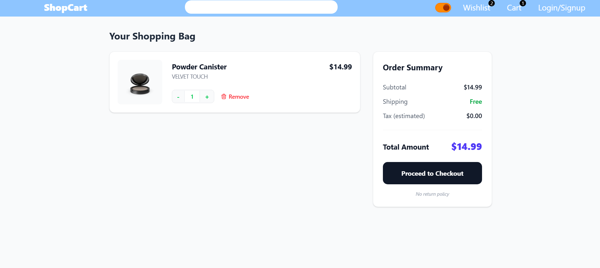
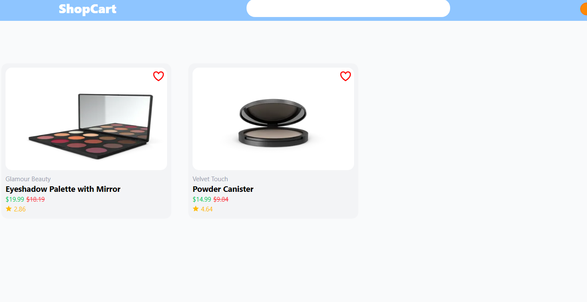

# 🛒 E-Commerce Website

Responsive Full Stack E-Commerce Website using React.js, Node.js, Express.js and MongoDB.

---

# 🌐 Live Demo

🔗 Link:https://e-commercefsd.netlify.app/

---

# 📸 Website Preview

## 🏠 Home Page

---

## 📦 Product card Page

---

## 🛒 Cart Page

---

## 🔐 Wishlist Page

---

# ✨ Features 📋

⚡️ Fully Responsive E-Commerce Website  
⚡️ User Authentication (Login & Signup)  
⚡️ JWT Protected Routes  
⚡️ Product Search Functionality  
⚡️ Add to Cart Feature  
⚡️ Cart Quantity Management  
⚡️ REST API Integration  
⚡️ Redux Toolkit State Management  
⚡️ MongoDB Database Integration  
⚡️ Modern UI & Smooth User Experience  
⚡️ Add to Wishlist
⚡️Light and Dark Mode 

---

# 🛠️ Tech Stack 💻

## Frontend

✔️ React.js  
✔️ Redux Toolkit  
✔️ React Router DOM  
✔️ Axios  
✔️ Tailwind CSS / CSS  

---

## Backend

✔️ Node.js  
✔️ Express.js  
✔️ MongoDB  
✔️ Mongoose  
✔️ JWT Authentication  
✔️ bcrypt.js  

---

# 🚀 Deployment

## Frontend Deployment
✔️ Netlify / Vercel

## Backend Deployment
✔️ Render

---

# 📚 Sections

✔️ Home  
✔️ Navbar  
✔️ Login & Signup  
✔️ Light and dark Mode 
✔️ Product Details  
✔️ Search Functionality  
✔️ Cart Page  
✔️ Authentication  
✔️ Wishlist

---

# 🔒 Security Features

✔️ JWT Authentication  
✔️ Password Hashing using bcrypt  
✔️ Protected Routes  
✔️ Environment Variables Protection  

---

# 📈 Future Improvements

✔️ Payment Gateway Integration  
✔️ Order Tracking  
✔️ Admin Dashboard  
✔️ Product Reviews & Ratings  

---

